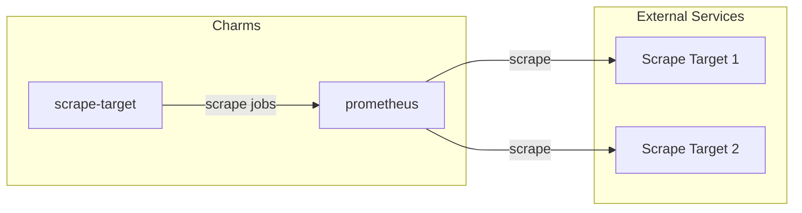

## Deployment scenarios

## Configuration Options

| Property       | Description                                                                                                    |
| -------------- | -------------------------------------------------------------------------------------------------------------- |
| `targets`      | Comma separated list of external scrape targets, e.g., "10.0.0.2:7000,10.0.0.3:7000". Do not add the protocol. |
| `labels`       | Comma separated list of label:value pairs.                                                                     |
| `job_name`     | Name of external scrape configuration jobs. Defaults to `external_jobs`.                                       |
| `metrics_path` | Metrics path for external jobs.                                                                                |
